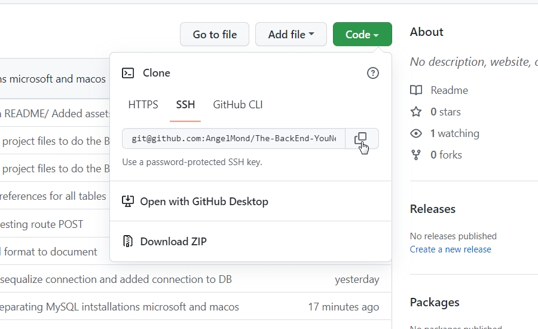

# E-Commerce-BackEnd

# About this project 
* As the title says, this app is a backEnd for an E-Commerce business, it works with NodeJS, and it uses one of the most popular DataBases System which is MySQL, and also I use Sequalize which is one of the most popular ORM's (Object-Relational-Mapping) in the market right now, so sequalize works with relational databases. With sequelize I create all the tables that the database will have so in the video below you'll see how I create the database through MySQL SHELL and then I fill the DataBase from NodeJS creating tables and seed that tables with NPM RUN SEED.

* Whether for new entrepreneurs or larger companies, they probably not only want but need this relational database model to better control the business.

* To connect the database with the server, and to set up a server that can listen to the requests that arrive to the database, I use mysql2 and express libraries. As well, I use enviroment variables using the Dotenv library, so you credentials will not be comprommised.

# Technologies used

    
    
    
    

# Code Project 

* Here you'll see an example from the original code defining the table "Category" using sequalize.

# Installation 

* In order to start with the installation, we first need to install NodeJS and MySQL.

* Node Installation

* Intallation On Windows:
    
    1. Navigate to 
<a src="https://nodejs.org/en/">https://nodejs.org/en/</a>

    2. Select the LTS version. At the time of writing this, the latest version is 16.15.1
    3. Once LTS installer finish to download, execute the intaller.
    4. Once the installer has finished, check through the command line the intalled version of NodeJS typing
             --version

* Intallation On MacOS

    1. You can follow the same steps for the Windows intallation going directly to <a src="https://nodejs.org/en/">https://nodejs.org/en/</a>, and follow the same steps for Windows.
    2. Or you can install Node intalling first Homebrew.

        * Homebrew Intallation

            1. Navigate to the ofical Homebrew WebSite. you can doing so by clicking here <a src="https://brew.sh/">https://brew.sh/</a>
            2. From the command line type the command 
            
/bin/bash -c "$(curl -fsSL https://raw.githubusercontent.com/Homebrew/install/HEAD/install.sh)"

            3. One finished the installation type the this command through the command line
            
brew install node

            4. For the last, check the installed version of NodeJS typing 
            
node -v

* MySQL Installation 

* Once we finish to install nodejs, we'll need to install MySQL 

    * Install for Windows: <a src="https://dev.mysql.com/doc/refman/8.0/en/windows-installation.html">https://dev.mysql.com/doc/refman/8.0/en/windows-installation.html</a>
    * Install for MacOS: <a src="https://dev.mysql.com/doc/refman/5.7/en/macos-installation-pkg.html">https://dev.mysql.com/doc/refman/5.7/en/macos-installation-pkg.html</a>

* When executing the installer you might also want to install MySQL Workbench, so, be sure to add it in your intallation when the program ask!
* If you have troubles with MySQL installation here's a youtube video for microsoft intallation <a src="https://www.youtube.com/watch?v=eq-e_n7lm2M">https://www.youtube.com/watch?v=eq-e_n7lm2M</a>

* Youtube video for MacOS MySQL intallation <a src="https://www.youtube.com/watch?v=-BDbOOY9jsc">https://www.youtube.com/watch?v=-BDbOOY9jsc</a>

# Ready to install

# Clone the repo
1. Clone the the repo in your local computer by copying the command (HTTPS, SSH, GitHub CLI), use the method you already are familiar with.
    * Example 
    ;
    * Here's a video to how you can generate your SSH Key <a src="https://www.youtube.com/watch?v=8X4u9sca3Io">https://www.youtube.com/watch?v=8X4u9sca3Io</a>

    * Once you have copied the command from github we need to go to node command line, and first you need to type "git clone" and then paste the command you already copied. 
        * Note: Maybe the command line ask you to introduce your password, if so, you just need to type it.

# Install dependencies
2. Once we have cloned successfully the repo, we need to install our dependencies by typing in the command line the next command:
    
npm install

# Create .env file
3. Once we have our dependencies installed, we need to create in the root directory a file named ".env".
    * Inside our "env." file, we need to paste this:
        

            DB_USER='your database user credentials here. Maybe you'll need to replace it for DB_USER="root"'
            DB_PW='your database password credentials here. If you dont have password just leave the "quotes"'
            DB_NAME='ecommerce_db'
        

# Create our DB called ecommerce_db;
4. Once we already put our credentials in our "env." file, we need to go to our "MySQL Workbench" or "MySQL Command Line Client" or "MySQL Shell" and type the following commands:
    * IMPORTANT: BE SURE YOU ARE NOT USING ALREADY A DATABASE NAMED ecommerce_db.
    
DROP DATABASE IF EXISTS ecommerce_db;

    
CREATE DATABASE IF NOT EXISTS ecommerce_db;

    * Once done this, go back to node.

# Create our tables in our DB
5. We already have created our DB (DataBase) and now we need to create our tables that will store all our data. We can do this by typing in the command line the following command: 
    
node server.js

    * At this point we already have our tables, now we need to seed our tables.

# Seed our tables
6. First press "Ctrl+C" to kill the server process and now type in the command line:
    
npm run seed

    * Now our DB it's already seeded!
# Turn on our server
7. For the last, we need to type again in the command line:

node server.js

* Now you have your saver listening in the route: "http://localhost:3001/"
* You can use Insomnia, Postman, ThunderClient to do requests to your server and your DataBase! 

# Methods to do requests

//Methods for categories

//GET 

<a>localhost:3001/api/categories</a> // get all categories

<a>localhost:3001/api/categories/:id</a> // get one category by its id

//POST

<a>localhost:3001/api/categories</a> // create a new category

//PUT

<a>localhost:3001/api/categories/:id</a> // update a category by its id value

//DELETE

<a>localhost:3001/api/categories/:id</a> // delete a category by its id value

//Methods for products 

//GET

<a>localhost:3001/api/products</a> // get all products

<a>localhost:3001/api/products/:id</a> // get one product by its id

//POST

<a>localhost:3001/api/products</a> // create a new product

//PUT

<a>localhost:3001/api/products/:id</a> // update a product by its id value

//DELETE

<a>localhost:3001/api/products/:id</a> // update a product by its id value

//Methods for tags

//GET

<a>localhost:3001/api/tags</a> // to get all tags

<a>localhost:3001/api/tags:id </a>// get one tag by its id

//POST

<a>localhost:3001/api/tags</a> // create a new tag

//PUT

<a>localhost:3001/api/tags:id</a> // update a tag by its id value

//DELETE

<a>localhost:3001/api/tags:id</a> // update a tag by its id value

# User Story

AS A manager at an internet retail company
I WANT a back end for my e-commerce website that uses the latest technologies
SO THAT my company can compete with other e-commerce companies

# Acceptance Criteria

GIVEN a functional Express.js API
WHEN I add my database name, MySQL username, and MySQL password to an environment variable file
THEN I am able to connect to a database using Sequelize

WHEN I enter schema and seed commands
THEN a development database is created and is seeded with test data

WHEN I enter the command to invoke the application
THEN my server is started and the Sequelize models are synced to the MySQL database

WHEN I open API GET routes in Insomnia for categories, products, or tags
THEN the data for each of these routes is displayed in a formatted JSON

WHEN I test API POST, PUT, and DELETE routes in Insomnia
THEN I am able to successfully create, update, and delete data in my database

# Challenges
* I think that the real challenge here is to create the internal connections that the database will have using only sequalize, although sequalize is really a great help when defining the references between each table in the DB, but I think that this can be easily solved by knowing the syntax used by sequalize.

# Link to Video!
* In the video you'll see the BackEnd functionality.

<a href="https://drive.google.com/file/d/1UsbSQ5RegvqVPKQghQcotLU7-IixRx02/view?usp=sharing">BackEnd Demo</a>

