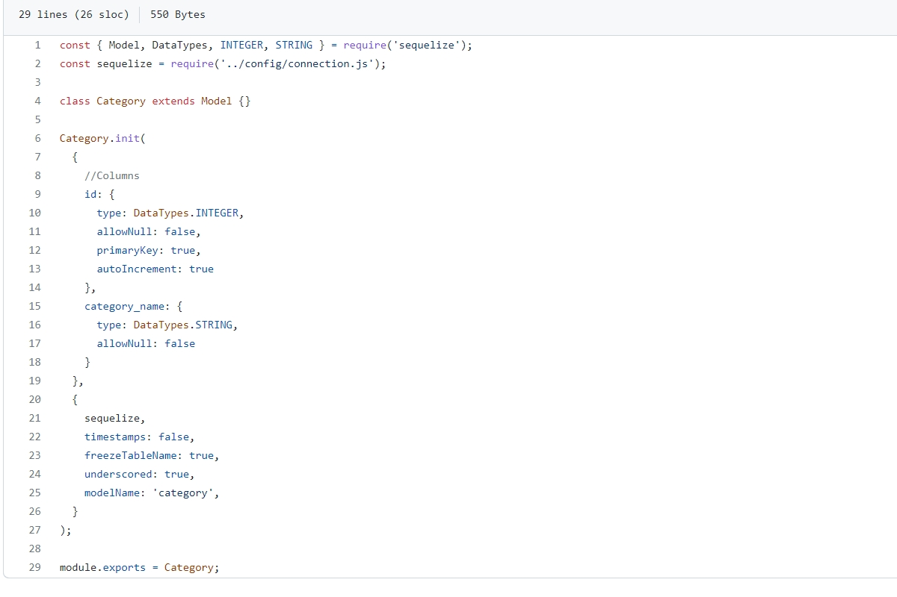

# E-Commerce-BackEnd

# About this project 
* As the title says, this app is a backEnd for an E-Commerce business, it works with NodeJS, and it uses one of the most popular DataBases System which is MySQL, and also I use Sequalize which is one of the most popular ORM's (Object-Relational-Mapping) in the market right now, so sequalize works with relational databases. With sequelize I create all the tables that the database will have so in the video below you'll see how I create the database through MySQL SHELL and then I fill the DataBase from NodeJS creating tables and seed that tables with NPM RUN SEED.

* Whether for new entrepreneurs or larger companies, they probably not only want but need this relational database model to better control the business.

* To connect the database with the server, and to set up a server that can listen to the requests that arrive to the database, I use mysql2 and express libraries. As well, I use enviroment variables using the Dotenv library, so you credentials will not be comprommised.

# Technologies used

    
    
    
    

# Code Project 

* Here you'll see an example from the original code defining the table "Category" using sequalize.

# Installation 

* In order to start with the installation, we first need to install NodeJS and MySQL.

* Node Installation

* Intallation On Windows:
    
    1. Navigate to 
<a src="https://nodejs.org/en/">https://nodejs.org/en/</a>

    2. Select the LTS version. At the time of writing this, the latest version is 16.15.1
    3. Once LTS installer finish to download, execute the intaller.
    4. Once the installer has finished, check through the command line the intalled version of NodeJS typing
             --version

* Intallation On MacOS

    1. You can follow the same steps for the Windows intallation going directly to <a src="https://nodejs.org/en/">https://nodejs.org/en/</a>, and follow the same steps for Windows.
    2. Or you can install Node intalling first Homebrew.

        * Homebrew Intallation

            1. Navigate to the ofical Homebrew WebSite. you can doing so by clicking here <a src="https://brew.sh/">https://brew.sh/</a>
            2. From the command line type the command 
            
/bin/bash -c "$(curl -fsSL https://raw.githubusercontent.com/Homebrew/install/HEAD/install.sh)"

            3. One finished the installation type the this command through the command line
            
brew install node

            4. For the last, check the installed version of NodeJS typing 
            
node -v

* MySQL Installation 

* Once we finish to install nodejs, we'll need to install MySQL 

    Install for Windows: <a src="https://dev.mysql.com/doc/refman/8.0/en/windows-installation.html">https://dev.mysql.com/doc/refman/8.0/en/windows-installation.html</a>
    Install for MacOS: <a src="https://dev.mysql.com/doc/refman/5.7/en/macos-installation-pkg.html">https://dev.mysql.com/doc/refman/5.7/en/macos-installation-pkg.html</a>

* When executing the installer you might also want to install MySQL Workbench, so, be sure to add it in your intallation when the program ask!
* If you have troubles with MySQL installation here's a youtube video for microsoft intallation <a src="https://www.youtube.com/watch?v=eq-e_n7lm2M">https://www.youtube.com/watch?v=eq-e_n7lm2M</a>

* Youtube video for MacOS MySQL intallation <a src="https://www.youtube.com/watch?v=-BDbOOY9jsc">https://www.youtube.com/watch?v=-BDbOOY9jsc</a>

# User Story

AS A manager at an internet retail company
I WANT a back end for my e-commerce website that uses the latest technologies
SO THAT my company can compete with other e-commerce companies

# Acceptance Criteria

GIVEN a functional Express.js API
WHEN I add my database name, MySQL username, and MySQL password to an environment variable file
THEN I am able to connect to a database using Sequelize

WHEN I enter schema and seed commands
THEN a development database is created and is seeded with test data

WHEN I enter the command to invoke the application
THEN my server is started and the Sequelize models are synced to the MySQL database

WHEN I open API GET routes in Insomnia for categories, products, or tags
THEN the data for each of these routes is displayed in a formatted JSON

WHEN I test API POST, PUT, and DELETE routes in Insomnia
THEN I am able to successfully create, update, and delete data in my database

# Challenges
* I think that the real challenge here is to create the internal connections that the database will have using only sequalize, although sequalize is really a great help when defining the references between each table in the DB, but I think that this can be easily solved by knowing the syntax used by sequalize.

# Link to Video!
* In the video you'll see the BackEnd functionality.

<a href="https://drive.google.com/file/d/1UsbSQ5RegvqVPKQghQcotLU7-IixRx02/view?usp=sharing">BackEnd Demo</a>

